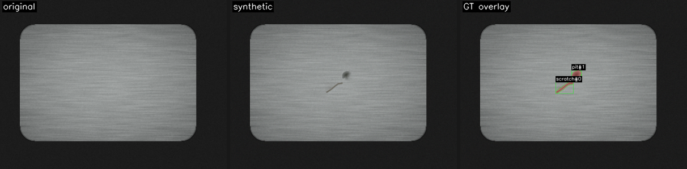
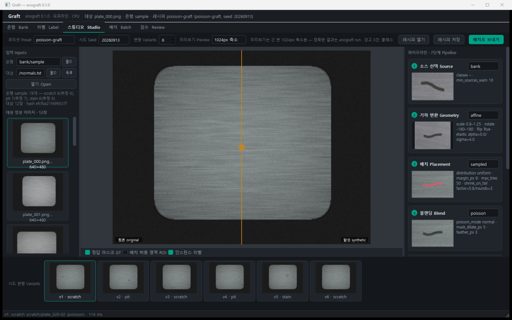
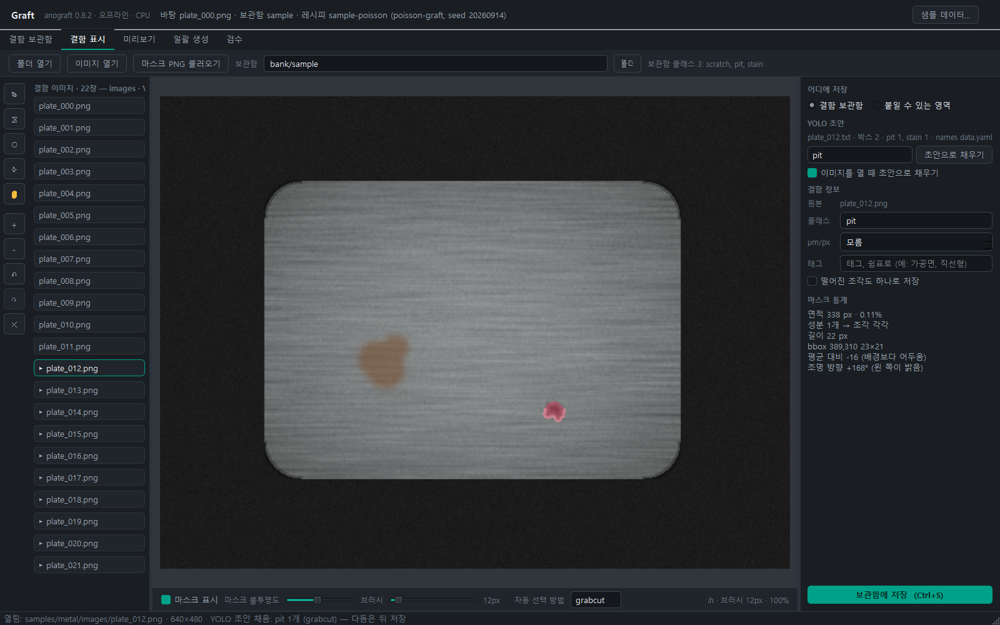
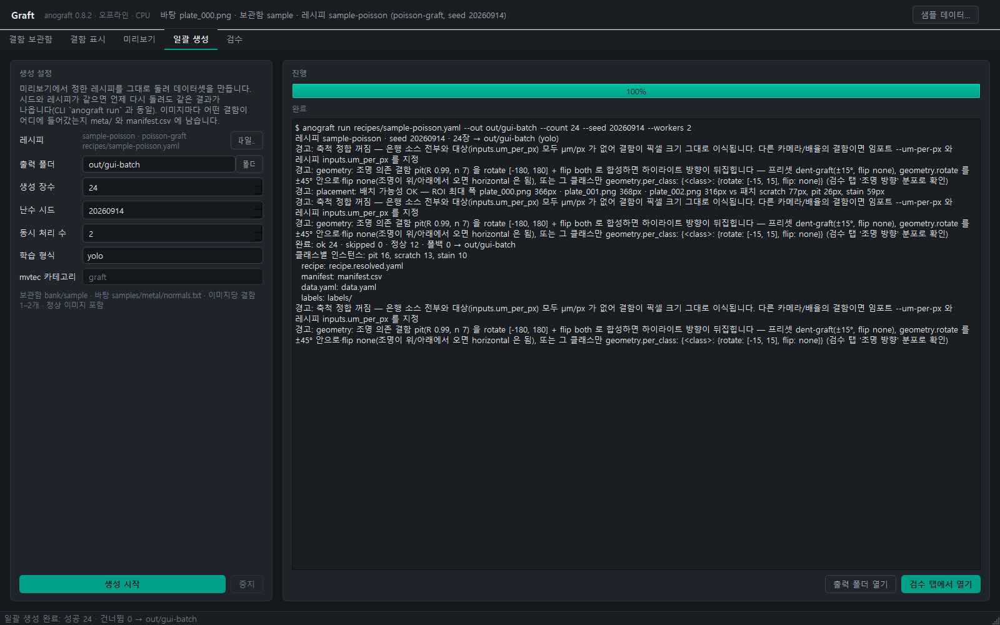
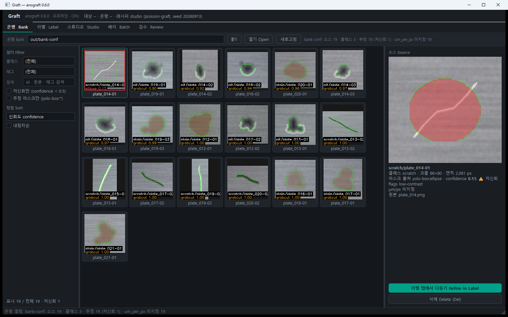
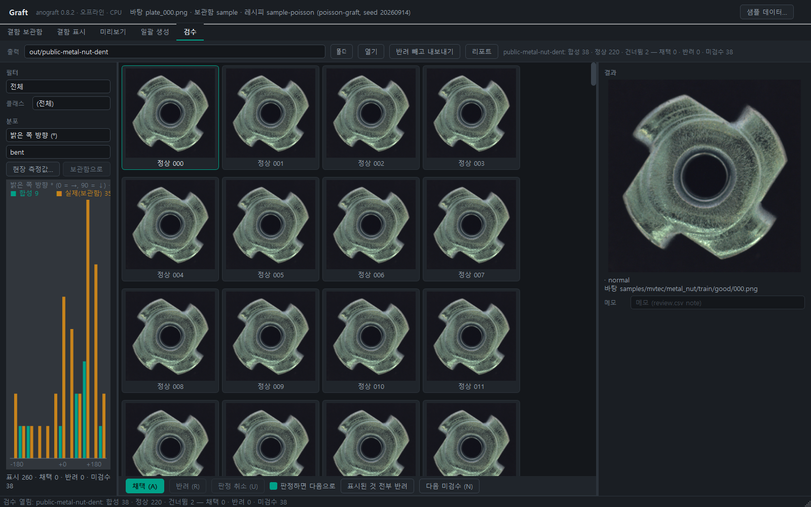
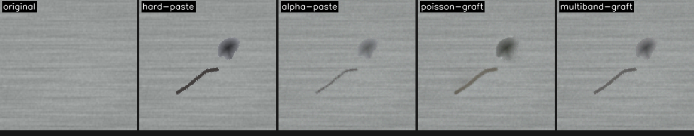

<div align="center">

# Graft

**라벨링한 실제 결함을 정상 이미지에 이식해, 정답 마스크와 재현 정보가 붙은 학습용 이상 데이터셋을 만듭니다.**

패키지·CLI 이름: `anograft` · 전 과정 오프라인·로컬 · CPU만으로 동작 · Windows zip은 파이썬 없이 실행

[English below ↓](#english)

</div>



> **상태: v0.7.3** — CLI 코어(7단계 파이프라인 · 레시피 · 결함 은행 · YOLO/MVTec/COCO 출력 · 프리셋 9종 · 은행 없이 도는 self-cut/perlin · 구조 정합 배치 · GrabCut·annulus ROI · VisA·DTD 어댑터)와 GUI **은행 · 라벨 · 스튜디오 · 배치 · 검수** 5탭 — 결함 사진만 있으면 GUI 만으로 라벨링 → 은행 정리 → 미리보기 → 데이터셋 생성 → 검수·정리본까지. 실데이터 1차 적용(경면 금속 원형 부품)에서 나온 [알려진 문제 10건](KNOWN-ISSUES.md)을 v0.6 에서 보정. **2차 실데이터 적용·표준셋 실제 사본·학습 1 epoch은 아직 미검증**(데이터가 생기면 아래 3줄로 확인).

## 왜

이상 탐지·결함 검출 모델은 결함 이미지가 늘 부족합니다. 합성 기법(CutPaste · DRAEM · NSA · 확산 인페인팅)은 이미 여럿 나와 있지만 논문 저장소마다 흩어져 있고, 그 사이의 실무가 비어 있습니다 — 결함을 **모아 두는 곳**, **어디에 붙일지**의 통제, **정답 마스크 정책**, **재현성**, 학습 파이프라인이 **바로 먹는 출력 형식**.

Graft는 알고리즘을 새로 만드는 도구가 아니라 그 사이를 메우는 도구입니다.

- **결함 은행** — 보유 YOLO 라벨(박스·폴리곤)이나 마스크 PNG에서 결함을 모읍니다. 박스만 있으면 마스크를 추정합니다(GrabCut 등, 출처를 `mask_origin`으로 끌고 다님). 데이터가 없으면 표준 산업 데이터셋(MVTec AD)을 로컬 사본에서 읽습니다.
- **7단계 파이프라인** `소스 → 기하 → 배치 → 블렌딩 → 조화 → 열화 → 정답 마스크` — 알고리즘은 각 단계의 `method`로 고릅니다(블렌딩: paste · alpha · Poisson · multiband, 조화: stats · Reinhard · 히스토그램 매칭, 배치: sampled · structure-aware, ROI: otsu · grabcut · none · mask_dir). 프리셋으로 시작하고 필요할 때만 펼칩니다.
- **배치 허용 영역(ROI)** 이 기본값 — 배경에 붙은 결함은 학습에 해롭습니다.
- **재현** — 레시피(YAML) + 시드가 같으면 워커 수와 무관하게 바이트 단위로 같은 데이터셋. 이미지마다 사이드카 JSON(소스 id · 변환 · 좌표 · 시드 · 파이프라인 해시).
- **출력** — 정본은 이미지 + GT 마스크 + 사이드카 + `manifest.csv`. 그 위에 writer가 학습 형식을 덧붙입니다(YOLO `labels/*.txt` + `data.yaml` — 기존 학습셋에 그대로 합침 · `mvtec` — anomalib 이 읽는 `mvtec/<category>/{train,test,ground_truth}` 레이아웃, v0.4 · `coco` — `annotations.json`(instances: 폴리곤 segmentation·bbox·area, categories = 은행 classes) — Detectron2·mmdetection 용, v0.7).

## 설치

| 방법 | 언제 | 명령 |
|---|---|---|
| **Windows zip** (권장) | 파이썬 없는 PC, 현장 | [Releases](https://github.com/slnu21/Graft/releases)에서 `anograft-<ver>-win64.zip` → 풀기 → 그 폴더에서 `.\anograft.exe`(CLI) · `.\anograft-gui.exe`(GUI). 설치·관리자 권한 없음 |
| **pip / uv** | 파이썬 3.10+ 이 있는 PC, Linux/macOS | `pip install "anograft[gui] @ git+https://github.com/slnu21/Graft.git"` 또는 `uv tool install "anograft[gui] @ git+https://github.com/slnu21/Graft.git"`(uv가 파이썬까지 받아 줌). `[gui]`를 빼면 CLI만(순수 wheel 4개). PyPI 등록은 예정 |
| **소스** | 개발 | 아래 [개발](#개발) |

의존성은 numpy · opencv-python-headless · pydantic · pyyaml(전부 순수 wheel — 컴파일러·GPU 불필요) + GUI는 PySide6(LGPL, 동적 링크).

## 5분 시작

보유 데이터가 없어도 됩니다. 샘플 YOLO 세트(브러시드 메탈 + scratch/pit/stain)로 끝까지 한 바퀴. **GUI 라면 상단 '샘플 데이터 Sample…' 버튼 하나**(판/원형 → 샘플·은행·레시피를 만들어 스튜디오에 엶), CLI 는 `anograft sample --out samples/metal --quickstart` 한 줄(아래는 단계별). zip을 푼 폴더(또는 repo 루트)에서:

```powershell
# zip 이면 anograft → .\anograft.exe
anograft sample --out samples/metal                                       # 샘플 이미지 22장 + YOLO 박스 라벨 (--shape ring: 원형 부품 — annulus ROI·dent-graft 연습)
anograft bank import-yolo --images samples/metal/images --labels samples/metal/labels `
    --names samples/metal/data.yaml --out bank/sample --list-normals samples/metal/normals.txt
anograft bank ls bank/sample                                              # 클래스별 소스 수 · 마스크 출처(정확/추정) · 저신뢰 · µm/px (--json 스크립트용)
anograft doctor                                                           # 환경 진단(버전·Qt·스레드·프리셋) — 문제 보고 첫 줄
anograft bank preview bank/sample --out out/bank-preview.png              # 추정 마스크를 눈으로 (amber = 추정, ellipse = 과라벨, 화살표 = 밝은 쪽 — 한 방향이면 조명 의존)
anograft run recipes/sample-poisson.yaml --workers 4                      # → out/sample/{images,masks,meta,labels,data.yaml,manifest.csv}
anograft preview recipes/sample-poisson.yaml --index 0 --compare-methods blend --out out/compare.png
anograft-gui recipes/sample-poisson.yaml                                  # GUI (zip: .\anograft-gui.exe · pip: python -m anograft.gui). 인자 없이 켜면 최근 레시피 복원, 없으면 시작 안내
```

`anograft methods`가 스테이지별 선택지와 가용 여부를, `anograft recipe init --preset <이름> --write my.yaml`이 프리셋을 펼친 레시피를 줍니다(`--roi annulus` 로 ROI 만 바꾸고 `--um-per-px` 로 대상 피치를 — 예: `--preset dent-graft --roi annulus` 는 원형 부품의 찍힘). 레시피 상대경로는 **현재 폴더 기준**입니다.



스튜디오 오른쪽 **파이프라인 카드**에서 스테이지별 method 를 고르고 **모든 파라미터를 바로 편집**합니다(레시피 스키마에서 자동 생성 — 범위·on/off·선택지·경로, `null` 은 체크 해제). 잘못된 값은 그 카드에 빨간 줄로 막히고, 결과는 레시피 저장에 그대로 반영됩니다 (v0.6).





**은행 탭**(v0.7)에서 소스를 신뢰도순으로 보고 저신뢰(빨간 테두리)를 골라 다듬거나 지웁니다. **검수 탭**(v0.7)에서 합성 결과를 A/R 로 판정하고, 왼쪽 히스토그램으로 합성(teal) vs 실제(amber) 분포(크기 · 대비 · 질감 · 선명도 · **조명 방향**)를 비교한 뒤 반려를 뺀 정리본을 내보냅니다. 아래 화면은 ±180° 회전 프리셋으로 찍힘(pit)을 합성한 결과 — 실제 소스의 하이라이트는 한 방향(amber 가 +90° 에 모임)인데 합성은 사방으로 퍼졌고, 필터 **조명 뒤집힘 의심**이 40장 중 33장을 골라냈다(→ `dent-graft`).





## 보유 데이터로

| 가진 것 | 명령 |
|---|---|
| YOLO 라벨(`images/`·`labels/*.txt`·`data.yaml`) | `anograft bank import-yolo --images … --labels … --names data.yaml --out bank/mine --list-normals normals.txt` (빈 라벨 이미지 = 정상 후보) |
| 이미지 + 마스크 PNG 쌍 | `anograft bank import-pairs --images … --masks … --class scratch --out bank/mine` (`--class-from-dir` · `--csv`) |
| MVTec AD 로컬 사본 | `anograft dataset info mvtec-ad` → `anograft bank import-dataset mvtec-ad <root>/metal_nut --out bank/metal_nut` (내려받지 않음, CC BY-NC-SA) |
| VisA 로컬 사본 | `anograft dataset info visa` → `anograft bank import-dataset visa <VisA>/candle --out bank/candle` (결함 유형 세분이 없어 클래스 `anomaly` 하나, CC BY-NC-SA) |
| DTD 텍스처(은행 없이 DRAEM 식) | `anograft dataset info dtd` → `anograft dataset textures dtd <dtd> --out textures.txt [--categories cracked,stained] [--limit 300]` → 레시피 `source: {method: perlin-texture, texture: dir, texture_dir: textures.txt}`. 결함이 아니라 은행에는 넣지 않는다(연구 목적 라이선스, 로컬 사본만) (v0.7) |
| **결함 사진만**(라벨 없음) | GUI **라벨 탭** — 폴더 열기 → 사진 선택 → 브러시/폴리곤/자동 선택(박스를 끌면 GrabCut) → 클래스 입력 → **은행에 저장**(Ctrl+S). 라벨링 도구가 따로 필요 없다 (v0.5). 그다음 스튜디오에서 미리보기 → **배치로 보내기** → 배치 탭 **생성 시작** — CLI 없이 끝까지 |
| 배치가 될지 미리 | `anograft run <recipe> --dry-run` — 배분·경고에 더해 **ROI 최대 폭 vs 클래스별 패치 폭**(가능/빠듯/불가): 좁은 링에 큰 패치면 돌리기 전에 안다 |
| 합성 결과 검수 | GUI **검수 탭**(v0.7) — 출력 폴더를 열어 썸네일로 보고 A/R 로 채택·반려(`review.csv`), 합성 vs 실제(은행) 분포 히스토그램(면적·긴 변·대비·질감·선명도·**조명 방향** — 회전이 하이라이트를 뒤집으면 클래스별 R 로 드러나 `dent-graft` 를 권함), **정리본 내보내기**(반려 제외), **리포트**(HTML 한 장). CLI `anograft dataset prune <out> --out <pruned>` · `dataset report <out>` |
| 은행 정리 | GUI **은행 탭**(v0.7) — 소스 그리드(저신뢰 빨간 테두리) · 필터/정렬 · 삭제 · **라벨 탭에서 다듬기**(마스크를 고쳐 같은 id 에 덮어쓰기). `bank ls`/`bank preview` 의 GUI 판 |
| YOLO 라벨을 GUI 에서 다듬기 | 라벨 탭에서 `images/` 를 열면 옆의 `labels/<stem>.txt`(+`data.yaml`)를 찾아 **YOLO 초안**으로 마스크를 미리 채운다(박스 → GrabCut 추정, 폴리곤 → 채움, 목록에 `▸`). 손보고 저장하면 `manual:mixed`, 그대로 저장하면 임포터와 같은 `yolo-box:*` (v0.6) |
| 결함이 생겨도 되는 면만 지정(ROI) | 라벨 탭 **저장 대상 → ROI 마스크**: 정상 이미지 폴더를 열고 허용 영역을 칠해 `<mask_dir>/<stem>.png` 로 저장 → 레시피 `placement.roi: {method: mask_dir, path: <mask_dir>}`. 원형 부품은 파일 없이 `annulus` ROI (v0.6) |

그다음은 `recipe init` → `inputs.bank`·`inputs.targets`(정상 이미지 폴더 또는 목록) 수정 → `run`. 출력 `images/`·`labels/`·`data.yaml`은 기존 YOLO 학습셋에 그대로 합쳐집니다(같은 `names` 순서). `python tools/train_smoke.py --synthetic out/sample --base <기존셋> --out train/merged`가 합쳐서 `ultralytics` 1 epoch을 돌립니다(ultralytics는 별도 설치, `--dry-run`은 합치기만).

`bank ls`의 `est`·origins 열에서 `ellipse` 폴백 비율이 높으면(가늘고 희미한 스크래치) `--mask-from otsu`나 `--min-box`를 조정하세요 — 박스는 결함 경계가 아닙니다. 박스 추정 마스크에는 **타당성 점수**(`confidence` 0..1 — 마스크 안/밖 대비·박스 테두리 접촉·조각 수·포화)가 붙고, 0.5 미만은 `bank ls` `lowconf` 열·`bank preview` **빨간 테두리**·`run` 경고로 드러납니다(경면 금속처럼 면적은 그럴듯한데 엉뚱한 곳을 잡는 경우). 저신뢰 소스는 라벨 탭에서 YOLO 초안으로 열어 다듬으세요. `bank ls` 의 `lightR` 열은 클래스별 **조명 일관성**(실제 소스들의 하이라이트가 같은 방향인가, 1 = 전부 같은 방향) — 0.5 이상이면 찍힘·덴트류라 회전 ±180/flip 이 하이라이트를 뒤집으므로 `run` 이 경고하고 `dent-graft` 를 권합니다.

**여러 제품의 결함을 한 은행에** — 제품별로 따로 만든 은행은 `anograft bank merge bank/A bank/B --out bank/all --rename 찍힘=dent` 로 합치고(v0.7.x), 임포트마다 `--tags prodA,lot3` 로 표시해 두고, 레시피 `pipeline.source.tags: {include: [prodA, prodC], exclude: [old]}` 로 골라 씁니다(클래스는 그대로, 클래스 안의 풀만 줄어듦 · `run --dry-run` 이 필터 후 소스 수를 보여줌). **다른 카메라/배율의 결함**은 크기가 틀어지므로 임포트 `--um-per-px` 와 레시피 `inputs.um_per_px` 를 둘 다 지정하세요 — 한쪽이라도 없으면 축척 정합이 꺼진 채(`factor 1.0`) 돌아가고, `bank ls` 의 `no_um` 열과 `run`/GUI 상태바가 이를 경고합니다.

**라벨링한 결함이 하나도 없다면** — 정상 이미지만으로 `self-cut`(CutPaste) · `perlin-texture`(DRAEM) 프리셋이 돕니다: `anograft recipe init --preset self-cut --targets <정상 폴더> --write r.yaml`(`inputs.bank: null`) → `run`. 클래스는 `cutpaste`/`anomaly` 하나(이상 탐지 이진 학습용). `preview --compare-methods source`로 세 소스를 나란히.

## 프리셋

같은 시드·같은 대상에 프리셋 4종(`preview --compare-methods blend|harmonize`로 스테이지별 비교도 가능):



| 프리셋 | 계열 | 블렌딩 · 조화 | 쓰임 |
|---|---|---|---|
| `poisson-graft` (기본) | NSA | Poisson(normal) · stats 0.3 | 대부분의 결함. 얼룩처럼 그래디언트가 약한 결함도 살린다 |
| `multiband-graft` | 라플라시안 피라미드 | multiband · histmatch 0.3 | 텍스처 보존이 좋고 경계 halo가 덜함 |
| `alpha-paste` | 페더 합성 | alpha(feather 2) · Reinhard 0.5 | 빠름, 경계 색 정합 |
| `hard-paste` | CutPaste(은행) | paste · 없음 | 가장 거친 대조군(학습 실험용) |
| `self-cut` | CutPaste·Scar | 소스 = 대상 자신의 사각/스카 패치 + 색 지터 · paste | **은행 불필요** — 정상 이미지만으로 시작 |
| `perlin-texture` | DRAEM | 소스 = 펄린 노이즈 마스크 + 텍스처(대상 자신 증강 또는 `texture_dir`) · alpha β 0.4~1 | **은행 불필요** — 불규칙한 이상 영역 |
| `structure-aware-graft` | 구조 정합 배치 | poisson-graft + 배치 `structure-aware`(그래디언트 큰 곳 선호 · 결·에지 방향에 정렬) · ROI `grabcut` | 스크래치가 결을 따르고 칩이 모서리에 생기는 부품. 무광·그림자로 Otsu가 안 갈리는 대상 |
| `annulus-graft` | 링 ROI | poisson-graft + ROI `annulus`(중심·반경을 대상마다 자동 검출, `r_inner`/`r_outer` 비율) | **원형 부품의 가공 링 면에만** 결함을 놓는다 — otsu/grabcut 은 물체 전체를 허용해 중앙 리세스에도 떨어졌다. 촬영마다 부품이 움직여도 링이 따라간다 (v0.6) |
| `dent-graft` | 조명 의존 결함 | poisson NORMAL + 회전 **±15°**·flip 끔·축척 0.9~1.1 · `structure-aware`(위치 균등, 방향은 결·접선 정렬, jitter 5°, **정렬 상한 30°** — 그 이상 돌려야 하는 자리는 정렬 안 함) · 조화 0.2 | **찍힘·덴트·눌림** — 3D 변형이라 보이는 모양이 곧 조명 효과. ±180° 로 돌리면 음영/하이라이트가 뒤집혀 물리적으로 불가능한 그림이 된다. 스크래치·얼룩은 다른 프리셋(±180 유지) (v0.6) |

한 은행에 스크래치(±180° 무방)와 찍힘(조명 의존)이 **섞여 있으면** 프리셋을 둘로 나누지 말고 `geometry.per_class` 로 그 클래스만 좁힙니다 — `per_class: {찍힘: {rotate: [-15, 15], flip: false}}` (준 필드만 덮어씀, 나머지 클래스는 그대로; `bank ls` 의 lightR ≥ 0.5 인 클래스가 후보, `run` 경고가 이 문법을 알려줍니다). `anograft recipe init --bank bank/mine --auto-dent` 가 그 클래스를 찾아 써 줍니다(`--dent-class 찍힘` 으로 직접도).

기본값은 샘플 은행에서 "결함이 옅어지는 정도"(hard-paste 대비 마스크 안 L1 비율)를 재서 정했습니다 — 세 조화 방법 모두 정의상 결함 톤을 대상 쪽으로 당기므로 strength를 낮게 뒀습니다. 실데이터 학습 mAP 근거는 아직 없습니다(로드맵).

**재현 보증 범위**: 같은 OS · 같은 OpenCV 부버전에서 바이트 동일. 다른 환경에서는 `cv2.seamlessClone` 내부 솔버 차이로 픽셀 단위 차이가 있을 수 있습니다. zip은 OpenCV를 함께 실으므로 zip끼리는 동일합니다.

## 개발

```powershell
git clone https://github.com/slnu21/Graft.git ; cd Graft
.\bootstrap.ps1 -Gui             # venv + pip install -e ".[dev,gui]"   (Linux/macOS: ./bootstrap.sh)
.venv\Scripts\Activate.ps1
pytest ; ruff check . ; ruff format --check .
.\bootstrap.ps1 -Build ; .\tools\build_zip.ps1   # Windows zip (PyInstaller) → dist/anograft-<ver>-win64.zip
```

구조·규약은 `CLAUDE.md`, 진행은 `docs/TASKS.md`, v0.1 설계는 `docs/design/v0.1-core.md`(docs는 로컬 컨텍스트). 새 알고리즘 = 스테이지 클래스 1 + 레지스트리 1줄 + 프리셋 YAML 1장.

## 라이선스

MIT © 2026 slnu21 — `LICENSE`. 함께 배포되는 구성 요소(PySide6/Qt LGPL 등)는 `THIRD-PARTY-NOTICES.md`, 오프라인·로컬 원칙은 `PRIVACY.md`.

외부 데이터셋(MVTec AD 등)·모델 가중치는 각자의 라이선스를 따르며, Graft는 재배포하지 않고 로컬 사본을 읽기만 합니다.

---

<div align="center">

## English

</div>

**Graft real, labeled defects onto normal images to build training datasets for anomaly detection — with ground-truth masks and full reproducibility metadata.** Package/CLI: `anograft`. Fully offline, CPU-only; the Windows zip needs no Python.

> **Status: v0.7.3** — CLI core (7-stage pipeline, recipes, defect bank, YOLO/MVTec/COCO output, 9 presets, bank-free self-cut/perlin sources, structure-aware placement, GrabCut/annulus ROI, VisA/DTD adapters) plus all five GUI tabs **Bank · Label · Studio · Batch · Review** — with only defect photos you can label → tidy the bank → preview → generate → review and export a pruned set entirely in the GUI. The [10 known issues](KNOWN-ISSUES.md) from a first real-data application (mirror-finish round metal part) are addressed in v0.6. **A second real-data pass, actual MVTec AD/VisA copies and a training epoch are still unverified** — three commands once you have data (below).

### Why

Synthetic-defect methods (CutPaste, DRAEM, NSA, diffusion inpainting) exist, but they live in scattered paper repos and the practical glue is missing: a place to **collect** defects, control over **where** they land, a **ground-truth mask policy**, **reproducibility**, and output your training pipeline can **consume directly**. Graft fills that gap instead of inventing another algorithm.

- **Defect bank** — import from your YOLO labels (boxes/polygons) or mask PNGs; boxes get a pixel mask estimated (GrabCut etc., provenance kept as `mask_origin`). No data? Point it at a local copy of MVTec AD.
- **7-stage pipeline** `source → geometry → placement → blend → harmonize → degrade → gt-mask` — pick algorithms per stage via `method` (blend: paste · alpha · Poisson · multiband; harmonize: stats · Reinhard · histogram matching; placement: sampled · structure-aware; ROI: otsu · grabcut · none · mask_dir). Start from a preset, unfold only what you need.
- **Placement ROI is on by default** — defects pasted onto background hurt training.
- **Reproducible** — same recipe (YAML) + seed ⇒ byte-identical dataset regardless of worker count. Per-image sidecar JSON (source id, transform, coordinates, seed, pipeline hash).
- **Output** — canonical image + GT mask + sidecar + `manifest.csv`, plus a writer layer for training formats (YOLO `labels/*.txt` + `data.yaml`, mergeable into your existing set; `mvtec` — the `mvtec/<category>/{train,test,ground_truth}` layout anomalib reads, v0.4; `coco` — `annotations.json` (instances: polygon segmentation, bbox, area, categories = bank classes) for Detectron2/mmdetection, v0.7).

### Install

| Method | When | Command |
|---|---|---|
| **Windows zip** (recommended) | No Python, shop-floor PCs | Grab `anograft-<ver>-win64.zip` from [Releases](https://github.com/slnu21/Graft/releases), unzip, run `.\anograft.exe` (CLI) / `.\anograft-gui.exe` (GUI) from that folder. No installer, no admin rights |
| **pip / uv** | Python ≥ 3.10, Linux/macOS | `pip install "anograft[gui] @ git+https://github.com/slnu21/Graft.git"` or `uv tool install "anograft[gui] @ git+https://github.com/slnu21/Graft.git"` (uv fetches Python for you). Drop `[gui]` for CLI-only (four pure wheels). PyPI listing planned |
| **Source** | Development | see [Development](#development) |

Dependencies: numpy · opencv-python-headless · pydantic · pyyaml (all pure wheels — no compiler, no GPU); the GUI adds PySide6 (LGPL, dynamically linked).

### Five-minute start

No data needed — the bundled sample set (brushed metal + scratch/pit/stain) runs the whole loop. **In the GUI it is one click**: the **Sample…** button at the top (plate / ring → sample set, bank and recipe, opened in Studio); on the CLI `anograft sample --out samples/metal --quickstart` does the same (step by step below). From the unzipped folder (or the repo root):

```powershell
# zip: anograft → .\anograft.exe
anograft sample --out samples/metal                                       # --shape ring: a round part for the annulus ROI / dent-graft path
anograft bank import-yolo --images samples/metal/images --labels samples/metal/labels `
    --names samples/metal/data.yaml --out bank/sample --list-normals samples/metal/normals.txt
anograft bank ls bank/sample
anograft bank preview bank/sample --out out/bank-preview.png              # eyeball estimated masks (amber = estimated)
anograft run recipes/sample-poisson.yaml --workers 4                      # → out/sample/{images,masks,meta,labels,data.yaml,manifest.csv}
anograft preview recipes/sample-poisson.yaml --index 0 --compare-methods blend --out out/compare.png
anograft-gui recipes/sample-poisson.yaml                                  # GUI (zip: .\anograft-gui.exe · pip: python -m anograft.gui)
```

`anograft methods` lists per-stage choices and availability; `anograft recipe init --preset <name> --write my.yaml` expands a preset (`--roi annulus` swaps only the ROI, `--um-per-px` sets the target pitch — e.g. `--preset dent-graft --roi annulus` for dents on a round part). Relative paths in recipes resolve against the **current directory**.

In the Studio, the **pipeline cards** on the right let you pick each stage's method and **edit every parameter in place** (generated from the recipe schema — ranges, on/off, choices, paths; `null` = unchecked). Invalid values are rejected with a red line on that card, and edits go straight into the saved recipe (v0.6).

### Your own data

| You have | Command |
|---|---|
| YOLO labels (`images/`, `labels/*.txt`, `data.yaml`) | `anograft bank import-yolo --images … --labels … --names data.yaml --out bank/mine --list-normals normals.txt` (images with empty labels become normal candidates) |
| Image + mask PNG pairs | `anograft bank import-pairs --images … --masks … --class scratch --out bank/mine` (`--class-from-dir`, `--csv`) |
| Local MVTec AD copy | `anograft dataset info mvtec-ad` → `anograft bank import-dataset mvtec-ad <root>/metal_nut --out bank/metal_nut` (never downloaded; CC BY-NC-SA) |
| Local VisA copy | `anograft dataset info visa` → `anograft bank import-dataset visa <VisA>/candle --out bank/candle` (no defect-type split, so one class `anomaly`; CC BY-NC-SA) |
| DTD textures (DRAEM-style, no bank) | `anograft dataset info dtd` → `anograft dataset textures dtd <dtd> --out textures.txt [--categories cracked,stained] [--limit 300]` → recipe `source: {method: perlin-texture, texture: dir, texture_dir: textures.txt}`. Not defects, so never imported into a bank (research-only licence, local copy only) (v0.7) |
| **Only defect photos** (no labels) | GUI **Label tab** — open folder → pick a photo → brush / polygon / auto-select (drag a box → GrabCut) → type the class → **Save to bank** (Ctrl+S). No separate labelling tool needed (v0.5). Then preview in Studio → **Send to batch** → **Run** in the Batch tab — no CLI required |
| Will it place? | `anograft run <recipe> --dry-run` — besides allocation and warnings, **ROI max width vs per-class patch size** (ok / tight / impossible): know before running that a big patch will not fit a narrow ring |
| Review results | GUI **Review tab** (v0.7) — open an output folder, accept/reject thumbnails with A/R (`review.csv`), compare synthetic vs real (bank) histograms (area, length, contrast, texture, sharpness, **lighting direction** — when rotation flips the highlights, the per-class concentration R exposes it and suggests `dent-graft`), **export a pruned copy** without the rejects, and a one-page **HTML report**. CLI `anograft dataset prune <out> --out <pruned>` · `dataset report <out>` |
| Tidy the bank | GUI **Bank tab** (v0.7) — source grid (red border = low confidence), filter/sort, delete, **Refine in Label** (fix the mask and overwrite the same id). The GUI counterpart of `bank ls` / `bank preview` |
| Refine YOLO labels in the GUI | Open `images/` in the Label tab: the neighbouring `labels/<stem>.txt` (+`data.yaml`) is loaded as a **YOLO draft** that pre-fills the mask (box → GrabCut estimate, polygon → fill; `▸` in the list). Edited masks save as `manual:mixed`, untouched ones as `yolo-box:*` like the importer (v0.6) |
| Restrict where defects may go (ROI) | Label tab **Save as → ROI mask**: open the normal-image folder, paint the allowed surface, save to `<mask_dir>/<stem>.png` → recipe `placement.roi: {method: mask_dir, path: <mask_dir>}`. Round parts need no files — use the `annulus` ROI (v0.6) |

Then `recipe init` → edit `inputs.bank` / `inputs.targets` (normal-image folder or list) → `run`. The output `images/`, `labels/`, `data.yaml` merge straight into an existing YOLO set (same `names` order). `python tools/train_smoke.py --synthetic out/sample --base <your set> --out train/merged` merges and runs one `ultralytics` epoch (install ultralytics separately; `--dry-run` only merges).

If `bank ls` shows many `ellipse` fallbacks (thin, faint scratches), try `--mask-from otsu` or adjust `--min-box` — a box is not a defect boundary. Every box-estimated mask carries a **plausibility score** (`confidence` 0..1 — inside/outside contrast, box-edge contact, fragment count, saturation); below 0.5 it shows up in the `lowconf` column of `bank ls`, as a **red border** in `bank preview`, and as a `run` warning (mirror-like metal where a plausible-sized but wrong region gets picked). Refine such sources in the Label tab via the YOLO draft. The `lightR` column of `bank ls` is the per-class **lighting consistency** of the real sources (1 = every highlight points the same way); at 0.5 or above the class behaves like a dent, so ±180° rotation or flips would invert the highlights — `run` warns and suggests `dent-graft`.

**Several products in one bank** — merge per-product banks with `anograft bank merge bank/A bank/B --out bank/all --rename dent_ko=dent` (v0.7.x), tag each import (`--tags prodA,lot3`) and select in the recipe with `pipeline.source.tags: {include: [prodA, prodC], exclude: [old]}` (classes stay the same, only the pool inside each class shrinks; `run --dry-run` shows the filtered counts). **Defects shot with another camera/magnification** come out the wrong size unless both `--um-per-px` at import and `inputs.um_per_px` in the recipe are set — with either missing, physical scaling is silently off (`factor 1.0`); the `no_um` column of `bank ls` and the `run`/GUI status bar warn about it.

**No labelled defects at all?** The `self-cut` (CutPaste) and `perlin-texture` (DRAEM) presets run on normal images alone: `anograft recipe init --preset self-cut --targets <normals> --write r.yaml` (`inputs.bank: null`) → `run`. Single class (`cutpaste` / `anomaly`) for binary anomaly training; `preview --compare-methods source` shows the three sources side by side.

### Presets

Same seed and target across the four presets (`preview --compare-methods blend|harmonize` compares within a stage):


| Preset | Family | Blend · harmonize | Use |
|---|---|---|---|
| `poisson-graft` (default) | NSA | Poisson (normal) · stats 0.3 | Most defects; keeps low-gradient stains alive |
| `multiband-graft` | Laplacian pyramid | multiband · histmatch 0.3 | Best texture preservation, fewer halos |
| `alpha-paste` | Feathered paste | alpha (feather 2) · Reinhard 0.5 | Fast, colour-matched edges |
| `hard-paste` | CutPaste (bank) | paste · none | Crudest baseline for training experiments |
| `self-cut` | CutPaste · Scar | source = rect/scar patch cut from the target itself + colour jitter · paste | **No bank needed** — start from normal images only |
| `perlin-texture` | DRAEM | source = Perlin-noise mask + texture (augmented self-window or `texture_dir`) · alpha β 0.4–1 | **No bank needed** — irregular anomaly regions |
| `structure-aware-graft` | Structure-aware placement | poisson-graft + `structure-aware` placement (prefers high-gradient spots · aligns to grain/edge direction) · `grabcut` ROI | Parts where scratches follow the grain and chips sit on edges; matte/shadowed parts Otsu cannot segment |
| `annulus-graft` | Ring ROI | poisson-graft + `annulus` ROI (centre/radius auto-detected per target, `r_inner`/`r_outer` as ratios) | **Round parts whose defects only occur on the machined ring** — otsu/grabcut allow the whole object and dropped defects into the central recess. The ring follows the part as it shifts between shots (v0.6) |
| `dent-graft` | Lighting-dependent defects | poisson NORMAL + rotation **±15°**, no flip, scale 0.9–1.1 · `structure-aware` (uniform position, axis aligned to grain/tangent, 5° jitter, **alignment capped at 30°** — spots needing more are left unaligned) · harmonize 0.2 | **Dents, dings, indentations** — 3D deformations whose appearance *is* the lighting. Rotating ±180° flips shadow/highlight against a light that did not move, which the eye catches first. Scratches and stains keep ±180° in the other presets (v0.6) |

When one bank **mixes** scratches (±180° is fine) and dents (lighting-dependent), do not split the recipe — narrow only that class with `geometry.per_class`: `per_class: {dent: {rotate: [-15, 15], flip: false}}` (only the given fields override; other classes are untouched; classes with `lightR` ≥ 0.5 in `bank ls` are the candidates, and the `run` warning spells out the syntax). `anograft recipe init --bank bank/mine --auto-dent` finds those classes and writes the override for you (`--dent-class dent` to name them yourself).

Defaults were chosen by measuring how much each method fades the defect on the sample bank (in-mask L1 relative to hard-paste); all three harmonize methods pull defect tone toward the target by construction, so strengths are kept low. No real-data mAP evidence yet (roadmap).

**Reproducibility scope**: byte-identical on the same OS and OpenCV minor version. Other environments may differ by a few pixels (`cv2.seamlessClone` solver). The zip ships its own OpenCV, so zip-to-zip results match.

### Development

```sh
git clone https://github.com/slnu21/Graft.git && cd Graft
./bootstrap.sh                   # venv + pip install -e ".[dev]"   (Windows: .\bootstrap.ps1 -Gui)
source .venv/bin/activate
pytest && ruff check . && ruff format --check .
# Windows zip: .\bootstrap.ps1 -Build ; .\tools\build_zip.ps1  →  dist/anograft-<ver>-win64.zip
```

A new algorithm = one stage class + one registry line + one preset YAML.

### License

MIT © 2026 slnu21 — `LICENSE`. Bundled components (PySide6/Qt LGPL, …) in `THIRD-PARTY-NOTICES.md`; the offline/local promise in `PRIVACY.md`. External datasets and model weights keep their own licenses; Graft never redistributes them.
